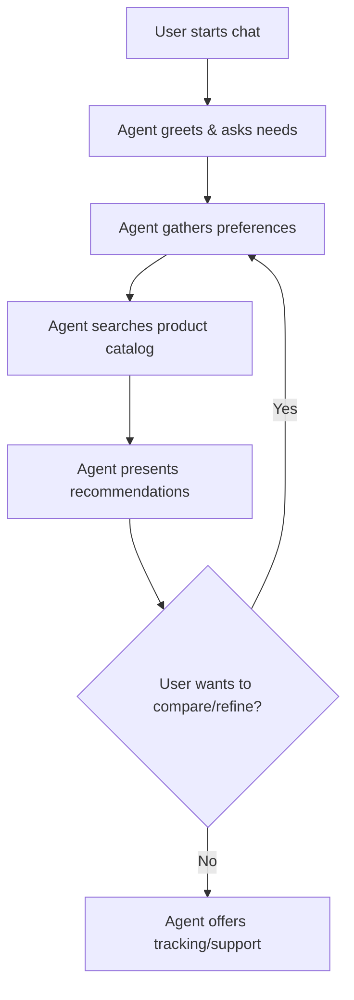

# 🛍️ AI Shopping Assistant MVP

A personalized e-commerce shopping assistant built with **LangChain + OpenAI GPT-4** (or local LLMs like Ollama) that helps customers find and purchase products through natural conversation.

## 🎯 Use Case

This MVP demonstrates how Agentic AI can transform the e-commerce shopping experience by:
- Providing personalized product recommendations
- Guiding customers through the purchase process
- Handling post-purchase support
- Learning from user preferences and behavior

## 🏗️ Architecture & Agent Workflow

The agentic workflow is designed to guide the user through a personalized shopping journey, as shown below:



**Workflow Steps:**
1. **User starts chat:** The user initiates a conversation with the shopping assistant.
2. **Agent greets & asks needs:** The agent welcomes the user and inquires about their shopping goals.
3. **Agent gathers preferences:** The agent collects user preferences (e.g., category, budget, brand).
4. **Agent searches product catalog:** The agent queries the product API for matching items.
5. **Agent presents recommendations:** The agent displays top product options and details.
6. **Decision loop:** If the user wants to compare or refine, the agent loops back to gather more preferences; otherwise, it proceeds.
7. **Agent offers tracking/support:** After a decision, the agent helps with order tracking or support as needed.

This agentic workflow enables a dynamic, context-aware, and goal-driven shopping experience, far beyond a simple prompt-based chatbot.

## 🚀 Quick Start

### Prerequisites
- Python 3.8+
- OpenAI API key **or** a local LLM (e.g., Ollama)
- pip (Python package manager)

### 1. Clone and Setup
```bash
# Install dependencies
pip install -r requirements.txt

# Copy environment template
cp config.env.example .env

# Edit .env file with your OpenAI API key (if using OpenAI)
# OPENAI_API_KEY=your_actual_api_key_here
```

### 2. Start the Mock E-commerce APIs
```bash
python mock_apis.py
```
This starts the mock backend services on port 8001 (or your chosen port).

### 3. Start the Shopping Assistant
```bash
python web_interface.py
```
This starts the web interface on port 8000 (or your chosen port).

### 4. Access the Application
Open your browser and go to: `http://localhost:8000`

## 🎮 How to Use

### Web Interface
1. **Open the chat interface** at `http://localhost:8000`
2. **Start chatting** with the shopping assistant
3. **Try these example conversations**:

```
User: "I'm looking for wireless headphones"
Assistant: [Searches and recommends products]

User: "What's my budget range?"
Assistant: [Shows user preferences]

User: "I want to buy the TechSound headphones"
Assistant: [Guides through purchase process]

User: "Show me my order history"
Assistant: [Displays past orders]
```

### API Endpoints
- `GET /` - Web chat interface
- `POST /chat` - REST API for chat
- `POST /start-conversation` - Start new conversation
- `GET /health` - Health check
- `WebSocket /ws` - Real-time chat

## 🛠️ Features

### Shopping Agent Capabilities
- ✅ **Product Search** - Find products by category, price, brand
- ✅ **User Preferences** - Remember and use customer preferences
- ✅ **Product Recommendations** - Personalized suggestions
- ✅ **Purchase Process** - Guide through checkout
- ✅ **Order Tracking** - Check order status and history
- ✅ **Conversation Memory** - Remember context across messages

### Mock E-commerce APIs
- ✅ **Product Catalog** - Search and filter products
- ✅ **User Management** - Store preferences and history
- ✅ **Order Processing** - Create and track orders
- ✅ **Checkout System** - Handle purchases

### Web Interface
- ✅ **Real-time Chat** - WebSocket-based communication
- ✅ **Beautiful UI** - Modern, responsive design
- ✅ **Product Cards** - Visual product display
- ✅ **Typing Indicators** - User experience enhancements

## 📁 Project Structure

```
├── README.md                 # This file
├── requirements.txt          # Python dependencies
├── config.env.example        # Environment variables template
├── mock_apis.py             # Mock e-commerce backend APIs
├── shopping_agent.py        # Main LangChain shopping agent
├── web_interface.py         # FastAPI web interface
└── agentic_ai_ecommerce_use_case.md  # Use case documentation
```

## 🔧 Configuration

### Environment Variables
```bash
# Required for OpenAI
OPENAI_API_KEY=your_openai_api_key_here

# Optional (defaults to localhost:8001)
PRODUCT_API_BASE_URL=http://localhost:8001/api/products
USER_API_BASE_URL=http://localhost:8001/api/users
CHECKOUT_API_BASE_URL=http://localhost:8001/api/checkout
ORDER_API_BASE_URL=http://localhost:8001/api/orders
```

### Mock Data
The mock APIs include sample data:
- **Products**: 4 sample products (electronics, clothing, footwear)
- **Users**: 1 sample user with preferences
- **Orders**: Empty initially, created during testing

## 🧪 Testing the MVP

### 1. Basic Conversation Flow
```
User: "Hi, I need help finding a gift"
Assistant: [Greets and asks for preferences]

User: "I'm looking for electronics under $200"
Assistant: [Searches and shows relevant products]

User: "Tell me more about the wireless headphones"
Assistant: [Shows detailed product information]

User: "I want to buy them"
Assistant: [Guides through purchase process]
```

### 2. Advanced Features
```
User: "What are my preferences?"
Assistant: [Shows user profile and preferences]

User: "Update my budget to $150-300"
Assistant: [Updates preferences]

User: "Show me my order history"
Assistant: [Displays past purchases]

User: "Track my recent order"
Assistant: [Shows order status]
```

## 🔍 API Documentation

### Mock E-commerce APIs (Port 8001)
- `GET /api/products` - Search products
- `GET /api/products/{id}` - Get product details
- `GET /api/users/{id}` - Get user profile
- `PUT /api/users/{id}/preferences` - Update preferences
- `POST /api/checkout` - Create order
- `GET /api/orders/{id}` - Get order details
- `GET /api/orders/user/{id}` - Get user orders

### Shopping Assistant APIs (Port 8000)
- `GET /` - Web interface
- `POST /chat` - Chat endpoint
- `WebSocket /ws` - Real-time chat
- `GET /health` - Health check

## 🚀 Next Steps for Production

### Phase 1: MVP Enhancements
- [ ] Add more product categories
- [ ] Implement user authentication
- [ ] Add payment processing
- [ ] Enhance product recommendations

### Phase 2: Advanced Features
- [ ] Multi-language support
- [ ] Voice interface
- [ ] Image-based product search
- [ ] Social shopping features

### Phase 3: Scale & Optimize
- [ ] Database integration
- [ ] Caching layer
- [ ] Load balancing
- [ ] Analytics and insights

## 🐛 Troubleshooting

### Common Issues

**1. OpenAI API Key Error**
```
Error: Invalid API key
```
Solution: Check your `.env` file and ensure `OPENAI_API_KEY` is set correctly.

**2. Port Already in Use**
```
Error: Address already in use
```
Solution: Change ports in the respective files or kill existing processes.

**3. Import Errors**
```
ModuleNotFoundError: No module named 'langchain'
```
Solution: Install dependencies with `pip install -r requirements.txt`

**4. WebSocket Connection Failed**
```
WebSocket connection failed
```
Solution: Ensure both servers are running (ports 8000 and 8001).

## 📊 Performance Metrics

- **Response Time**: ~2-5 seconds per message
- **Memory Usage**: ~100-200MB
- **Concurrent Users**: 10-50 (depending on OpenAI rate limits)
- **API Calls**: ~3-5 per conversation turn

## 🤝 Contributing

1. Fork the repository
2. Create a feature branch
3. Make your changes
4. Test thoroughly
5. Submit a pull request

## 📄 License

This project is for educational and demonstration purposes.

## 🙏 Acknowledgments

- **LangChain** for the agent framework
- **OpenAI** for GPT-4 language model
- **Ollama** for local LLM support
- **FastAPI** for the web framework
- **Pydantic** for data validation

---

**Ready to revolutionize e-commerce with AI? Start chatting with your shopping assistant! 🛍️✨** 