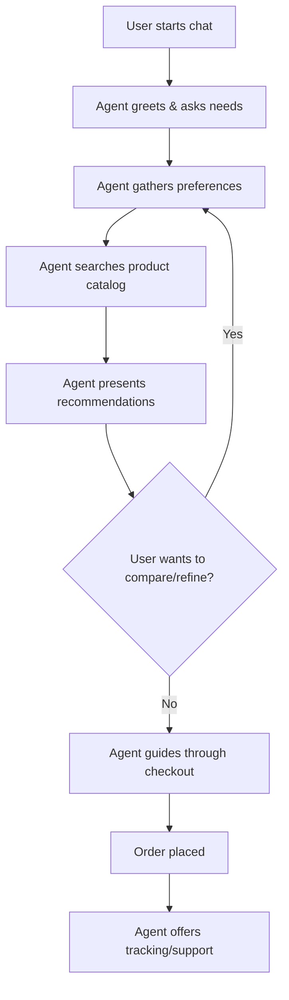

# Agentic AI Use Case: Personalized E-commerce Shopping Assistant

## 1. Use Case Description

In the fast-paced world of online shopping, customers often feel overwhelmed by the sheer volume of products and options available. Many shoppers abandon their carts or leave without making a purchase because they can't easily find what they want or aren't sure which product best fits their needs. Embedding an Agentic AI as a personalized shopping assistant can transform this experience. The agent can interact with customers in natural language, understand their preferences, budget, and style, and proactively guide them through product discovery, comparison, and checkout. It can also handle follow-up tasks like tracking orders or initiating returns, making the entire shopping journey seamless and engaging.

## 2. User Goal

**"Find and purchase the best product for my needs with minimal effort."**

## 3. Agent Workflow Design

### High-Level Task
- Help the user discover, compare, and purchase products tailored to their preferences.

### Tools/APIs Used
- Product catalog API (search, filter, details)
- User profile API (preferences, purchase history)
- Payment/checkout API
- Order tracking API
- Messaging/notification API

### Workflow Steps
1. **Initiate Conversation:** Agent greets user and asks about their shopping needs.
2. **Preference Gathering:** Agent asks clarifying questions (e.g., "What are you looking for?", "Any preferred brands or budget?").
3. **Product Search:** Agent queries the product catalog API with user preferences.
4. **Recommendation & Comparison:** Agent presents top options, highlights pros/cons, and can compare products.
5. **Decision Loop:** If user is undecided, agent can refine search, show more options, or answer questions.
6. **Checkout:** Agent guides user through purchase via checkout API.
7. **Post-Purchase:** Agent offers order tracking, support, or return initiation.

### Workflow Diagram



## 4. Prototype (Python Pseudocode)

```python
class ShoppingAgent:
    def __init__(self, user_profile_api, product_api, checkout_api, order_api):
        self.user_profile_api = user_profile_api
        self.product_api = product_api
        self.checkout_api = checkout_api
        self.order_api = order_api

    def start_conversation(self, user_id):
        print("Hi! What are you shopping for today?")
        preferences = self.gather_preferences(user_id)
        products = self.product_api.search(preferences)
        self.present_recommendations(products)
        choice = self.get_user_choice(products)
        if choice == "compare" or choice == "refine":
            return self.start_conversation(user_id)
        else:
            self.checkout_api.purchase(choice, user_id)
            print("Order placed! Would you like to track your order or need support?")

    def gather_preferences(self, user_id):
        # Ask user about needs, budget, style, etc.
        # Return structured preferences
        pass

    def present_recommendations(self, products):
        # Show top products, highlight features
        pass

    def get_user_choice(self, products):
        # Get user input: buy, compare, refine, etc.
        pass
```

## Summary

Agentic AI in e-commerce can act as a proactive, conversational shopping assistant, making product discovery and purchase effortless and personalized. The agent leverages APIs to search, recommend, and transact, looping as needed to refine results, and continues to support the user post-purchase. 